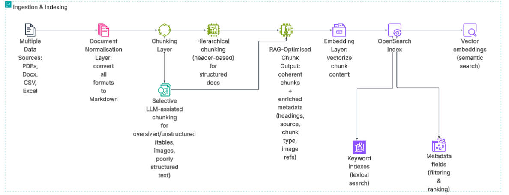
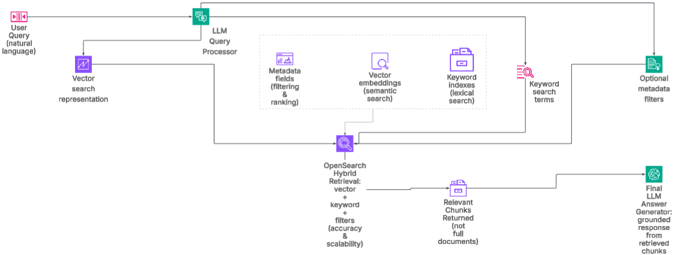

# RAG Document Ingestion, Embedding, and Retrieval - Complete
## Overview

This project implements a FastAPI-based ingestion and retrieval service for a Retrieval-Augmented Generation (RAG) pipeline.
It ingests .docx files, converts them to Markdown using Pandoc, applies a hybrid hierarchical + LLM-assisted chunking strategy, generates OpenAI embeddings for chunk content, and stores vectors + metadata in OpenSearch for production-ready retrieval.

The design prioritises determinism, performance, cost efficiency, and retrieval quality.

## Setup Instructions
### Prerequisites

* Python 3.10+

* Pandoc

* OpenAI API key
* OpenSearch cluster (local or managed)

* Install Pandoc

* Ensure Pandoc is installed and added to your PATH:

  -> pandoc --version

(Install via Homebrew, apt, or the Pandoc website depending on OS.)

* Environment Setup:

-- cd into project root 

-- run python -m venv .venv

-- enter env: .venv/scripts/activate

-- pip install -r requirements.txt

* Create a .env file:

-- OPENAI_API_KEY=your_api_key_here
-- OPENAI_EMBEDDING_MODEL=text-embedding-3-small
-- OPENAI_EMBEDDING_DIMENSIONS=1536
-- OPENSEARCH_HOST=localhost
-- OPENSEARCH_PORT=9200
-- OPENSEARCH_USERNAME=admin
-- OPENSEARCH_PASSWORD=admin
-- OPENSEARCH_USE_SSL=false
-- OPENSEARCH_VERIFY_CERTS=false
-- OPENSEARCH_INDEX=rag_chunks

* Run the API
  
-- uvicorn app.main:app --reload

### API Documentation
* POST /upload

-- Uploads and processes a .docx document, creates embeddings, and indexes chunks in OpenSearch.

* Request

-- multipart/form-data

* Field: file (must be .docx)

* Response

-- Processing status

-- File name

-- Number of chunks created and indexed

-- Target OpenSearch index name

* POST /search

-- Runs retrieval over indexed chunks with one of:

-- keyword search (BM25)

-- semantic search (vector similarity)

-- hybrid search (weighted reciprocal rank fusion)

* Search request fields

-- query: user query text

-- search_type: keyword | semantic | hybrid

-- top_k: number of results

-- filters: optional metadata filters (source, chunk_type, heading, sub_heading, section_title, date range)

-- keyword_weight / semantic_weight: used for hybrid ranking

* Errors are handled gracefully (empty files, unsupported formats, corrupted documents).

## Chunking Strategy
### Hierarchical Chunking (Primary)

* The system first chunks documents using their natural structure:

-- Headings and subheadings

* This approach is:

-- Fast (no AI involved)

-- Deterministic

-- Cost-effective

-- Context-aware

Most documents (in Organisations) are well structured, making this the preferred method.

* Headers and subheaders are preserved in metadata to:

-- Maintain document position

-- Enable metadata filtering

-- Improve retrieval relevance

### LLM-Assisted Chunking (Selective)

* LLMs are used only when necessary, for example:

-- Oversized chunks

-- Poorly structured documents

-- Tables or Images requiring semantic summaries

This ensures robustness while minimising latency and cost.

* Tables and Images:

-- Tables are preserved verbatim and summarised by an LLM, with the summary appended directly below the table.

-- Images are extracted by Pandoc, summarised upstream using a vision-capable LLM, and have their summaries injected into the Markdown.

-- This makes non-text elements searchable and embedding-friendly.

## Metadata Design (Retrieval-Oriented)

* Chunks are enriched with metadata to support:

-- Vector similarity search

-- Keyword filtering

-- Hybrid retrieval strategies

### Final Metadata Schema
* source:                 Data origin i.e. document or file name

* chunk_type:              text | table & text | image & text

* heading:                Top-level document heading

* sub_heading:           Nested section heading (if any)

* section_title:           chunk title

* image_paths:      Extracted image references

* date:                   Document or ingestion date

### Why this metadata works well for retrieval

- heading / sub_heading preserve document structure and enable context-aware filtering

- chunk_type allows selective retrieval (e.g. tables only)

- image_paths support multimodal reprocessing without polluting embeddings

- source and date enable provenance and temporal filtering

- RAG Readiness

## The indexed chunks are immediately suitable for:

- Vector databases

- Hybrid keyword + semantic search

- Re-ranking pipelines

- Chunk content is embedded with OpenAI Embeddings and persisted into OpenSearch with metadata.
- Retrieval is provided by the API and supports keyword, semantic, and hybrid ranking out of the box.

## Assumptions

- Most Organisations have documents that are well structured

- The pipeline remains robust when this assumption fails via selective LLM use

## Summary

This implementation demonstrates:

- A well-justified chunking strategy

- Robust preprocessing for unstructured data

- Retrieval-optimised storage design

- Clear separation between deterministic parsing and AI-based enrichment

- It is designed to integrate cleanly into a larger, production-grade RAG system.

# System Architecture (Part 2) - To be Implemented

The following diagrams illustrates the end-to-end architecture of the RAG-based unified search system.

* Ingestion and Indexing Process
* 

* Retrieval Process
* 

For more explanation and the reasoning behind the design decisions, see:
- [Architecture Legend & Design Rationale](docs/architecture-legend.md)

